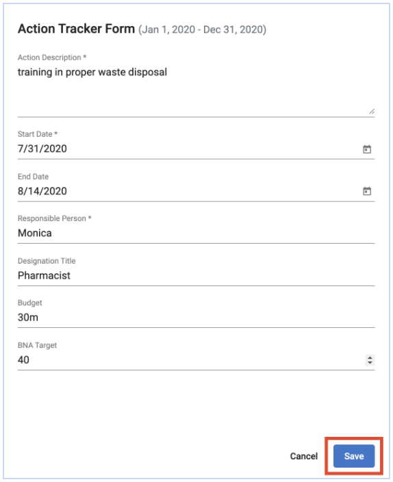
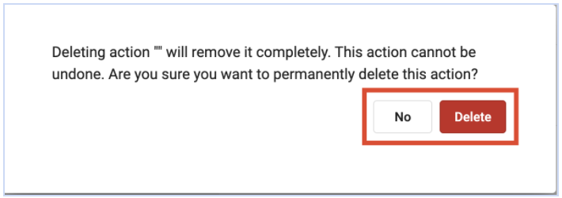
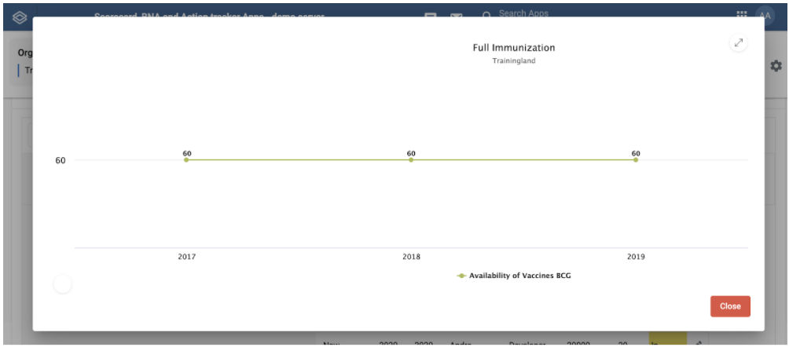
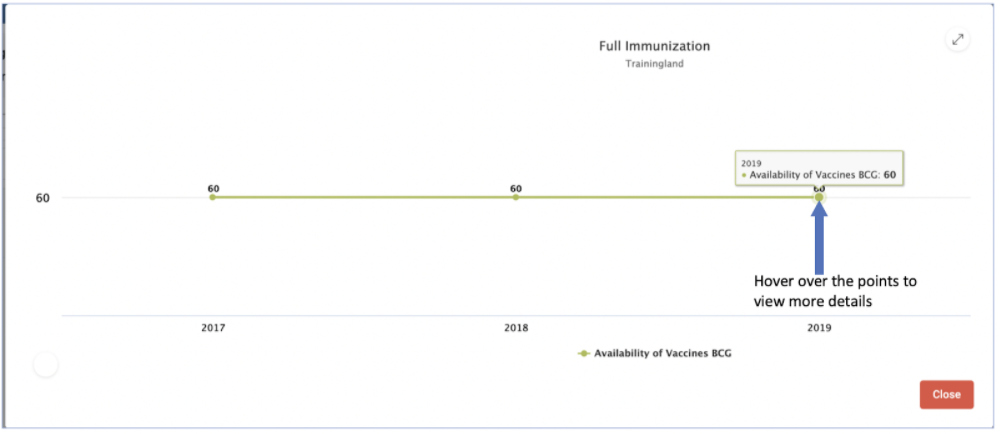

# Action Planning in Action Tracker

The action planning section allows you to record actions aimed at addressing the root causes of bottlenecks in the different determinants of health coverage. It provides a description of the actions required to address a specific problem, states the period within which this action should be done, responsible person, status of completion, review date and provides for any review notes.

## Action Planning

To access Action Planning option click on Action Planning tab
{width=40%}

To access option for adding new action, right click on the intervention on Add Actions column

{width=50%}

{width=50%}

### Action Description

This field (see Figure 2.1-C above) allows you to describe in detail the specific actions that will be taken to arrive at the proposed solution. The action recorded should be clear and specific. Only one action should be recorded and in case the proposed solution requires more than one, then another action is recorded as indicated in 2.1.B above.

### Start Date and End Date

These fields  (see Figure 2.1-C above) are for the period over which it is anticipated that the action will be performed.

### Responsible Person and Designation Title

These fields ((see Figure 2.1-C above) allow you to record the person who will be responsible for this action and their designation. This is important for follow up and progress of execution of the action.

### Budget

This field allows you to record the amount of money that has been allocated to execute the action.

### BNA Target

This field allows you to record the desired value to be attained by this indicator over a given period.  This should not be an arbitrary figure, however, it should be derived from approved program targets that were set by the respective program.

Once all the fields on  Figure 2.1-C above  have been filled, click on “update” to save the information in the action tracker.

{width=50%}

### Adding Actions

In cases where the possible solution requires more than one action, additional actions can be added using the add button in the last column to the right (See Figure 2.1-B above). Click the {width=10%} icon to add more actions to the proposed solution. Once the fields are filled, save to continue.

## Edit or Delete a Field

To Edit or Delete an entry, right click on any cell for a given intervention and edit or delete an entry accordingly.

{width=50%}

To edit the action, after clicking edit (Figure 2.1.2-A), update the data entry field where you want to make changes then click save (see Figure 2.1-D above)

To delete the action, after clicking the delete icon (Figure 2.1.2-A), click Yes if  you are sure  you want to delete action or click No if you don’t want to delete the action (Figure 2.1.2-B)

{width=50%}

### View Indicator Progress

To view the performance of the indicator over a period of time. Click on the chart icon.

{width=50%}

{width=50%}

Hover over the graph points to view more details about the indicator.

{width=50%}

Click on the resize button to view the graph in full screen or to exit the full screen

{width=50%}

Click on the close tab to close the graph

{width=50%}
