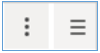
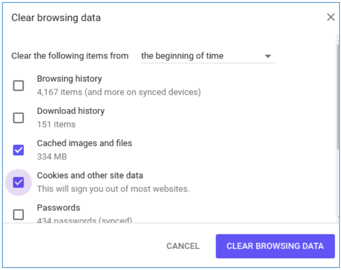

# Action Tracker App Maintenance

If the Action Tracker  application is taking too long to load, and you’re not
on a slow network, make sure you have cleared your browser cache.

Action Tracker Application makes good use of cached files for better offline
experience, as a result, when installing higher version, Action Tracker
Application may use older version of cached files and thus break down while loading.

## 5.1 Clearing application cache

Approaches to clear application cache and browser interface vary from browser
to browser; for example for Mozilla Firefox the keyboard shortcut is
“CTRL+SHIFT+DELETE” while for Google chrome the keyboard
shortcut is “CTRL+SHIFT+J”.

Accessing interface for clearing browser cache can be done via the following
approaches:		
• __Google chrome__​: Go to the menu icon on the top right corner,
and click it to open, go to more tools menu, and choose “Clear browsing data”.
Once the interface is open, Make sure, “Clear the following items from” is set
to “The beginning of time”. 				

• __Mozilla Firefox__​: Go to the menu icon on the top right corner, and click
it to open, go to ->Library, and go to History, and choose “Clear recent
history”. Once the interface is open, Make sure “Time range to clear” is set
to “Everything”, and “Details” option is expanded to show all details options.
Once on the clear browsing data or recent history, tick “Cache”, “Cookies”,
“Hosted app data” or “Offline Website data”. To clear all cached files, cookies
and locally stored data by bottleneck .

{width=10%}

__Note__: 

> These will also clear all cache information and cookies from other
> websites you visited in your browser.

{width=40%}
