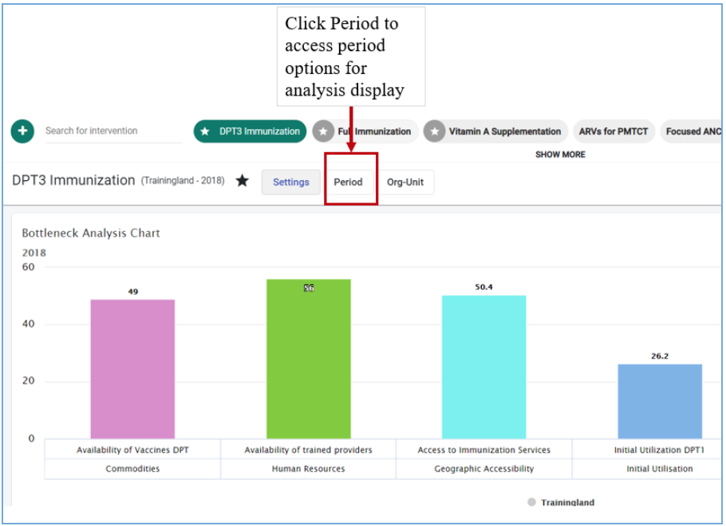
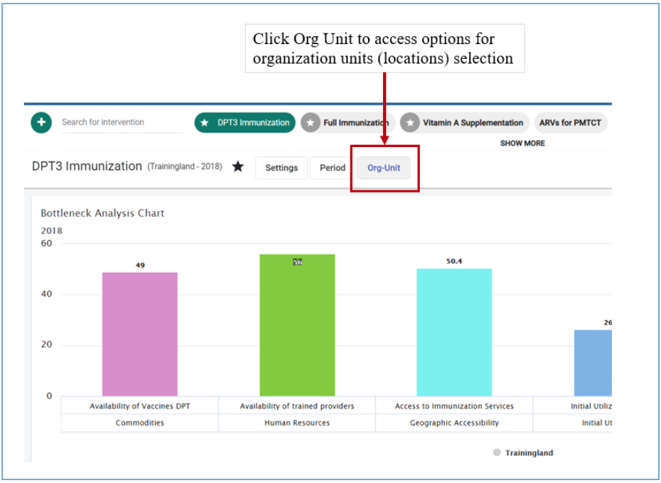
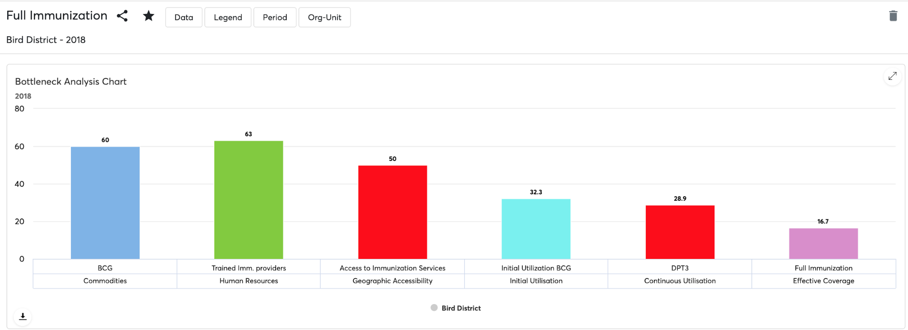

# BNA Analysis and Interpretation

Once created for the first time a blank BNA analysis chart will be displayed. The chart will be filled with data automatically as data is made available from linked datasets in the DHIS2 instance.

For non-administrators (e.g. districts users) and administrators they will have options to access interventions configured and shared with them for viewing analysis charts. For each intervention shared to the users, users will be able to further select periods and organization units (locations) for which they want to view bottleneck analysis for.

> **NOTE**
> Users can only access interventions shared with them by the administrator(s) who configured the intervention.

## Access intervention for analysis

Search for Bottleneck Analysis application and click on it

Upon loading the BNA App, users will have access to available interventions and an option to search for more interventions which may not be displayed upon loading. Accessing the shared interventions is limited to the access level they are shared.

## Selecting period for analysis

After selecting intervention to analyze, the user can specify which period he/she wants to view analysis for. To access option for selecting period for analysis display, click on Period tab

## Organization units selection

The BNA App allows the user to make organization unit selections based on groups, levels and user organization units, these are known as selection modes.

### Selection by levels and groups

From the list of Levels, under the input box that reads “Search Levels or groups”, users can then make their selections by clicking the desired levels to view the analysis on the BNA App.

### Selection by user organization unit

To the top of the selection by level there are buttons which are for selecting organization units relative to the user-assigned organization unit.  This gives flexibility for the users to view the data based on their assigned orgunits or suborgunits of their assigned orgunits.

> **NOTE**
> After completing selection of organization units, user must click on Update button to save changes

> **NOTE**
> Selections by user organization unit disables selection by organization unit tree. To disable selection by user organization unit simply click the active option (the one which appears with gray background) to inactivate it and enable selection by organization unit tree.

> **NOTE**
> Editing and saving configurations of a shared intervention will reflect the new configurations to the district end user with whom the intervention has been shared with.

**4.4 Exporting/Downloading bottleneck analysis chart**

To download the displayed bottleneck analysis chart user can choose from the three available download options (image, MS Excel or PDF

## Bottleneck analysis Interpretation

Bottleneck analysis a systematic way to look at the main determinants of
effective coverage for selected interventions to identify problem areas
to purposely act on them. The Six coverage determinants, from supply to
demand side, provide a mechanism to analyze where health system
bottlenecks exist. A bottleneck is a loss of system
efficiency. (Adapted from [Tanahashi T. Bulletin of the WorldHealth Organization, 1978, 56\(2\)_295-303.pdf](http://whqlibdoc.who.int/bulletin/1978/Vol56-No2/bulletin_1978_56&#40;2&#41;_295-303.pdf)).

Each intervention in the bottleneck analysis application comes with
three intervention items, the bottleneck analysis chart and sublevel
analysis table, and root cause analysis widget which are there to assist
the district user in analysing the bottlenecks and enter the route
causes and solutions for each identified bottleneck.

## Bottleneck chart operations

The bottleneck analysis chart is a bar graph of the bottleneck
indicators sub-divided in groups of their determinants. The bottleneck
analysis chart can be configured through the global filters whereas the
national level administrator can make data selections and sort the
arrangement of the determinants, determinant group color, organization
unit and period filters for other national users who are not
administrators, regional, and district users to make changes on
organization unit and period filters.

{width=50%}

## Analyzing bottleneck Charts

1.  Start from left to right: supply first, then demand, then quality
2.  Identify the lowest bar in the supply side (weakest determinant in
    the existing system)
3.  Identify the biggest drop in the demand side and quality

A bottleneck is a significant gap or drop in coverage determinant
between the expected and the observed. Services must be available first
before they are used. Therefore, bottlenecks are analyzed starting with
supply, followed by demand and finally by quality. The cascade rule
means that quality can not be higher than demand, and demand higher than
supply.

To highlight bottlenecks in the charts, simply click on the bar that
represents the identified bottleneck. The bar should change to color
RED.  This color is not saved as part of the values that represent the
different performances.

> **NOTE**
>
> To deselect the highlighted bars, click once
and the colors will be deselected to the default.

When the graph seems different from what we expect, care should be given
to assess common factors e.g. using different denominators for supply,
demand and quality.

## Sublevel Analysis

The sublevel analysis table makes use of the global filters that the
bottleneck analysis chart makes use of with an additional operation of
legend configurations for each indicator, that has been selected. It
presents sublevel analysis of performance each of the indicators in
determinant groups for selected intervention.

In sublevel analysis table, user can transpose the layout  of the table
to exchange presentation of indicators and sublevels. To transpose the
table, you have to click an icon just before the download icon below the
sublevel analysis table.

{width=50%}

## Additional Indicator dictionary

The BNA app is equipped with an indicator dictionary to provide
additional information on the indicators used in the definition and
creation of the BNA chart. To access the indicator dictionary, click on
the (i) icon in the sub-level analysis table.

{width=50%}

The indicator dictionary will display the list of indicators used in
creating the BNA chart, including numerators and denominators,
calculation details, and corresponding data elements. You can also click
on the “Export” button to export the indicator dictionary to excel. To
switch back to the table view, click on the Table icon.

{width=50%}

## Root Cause analysis

After the district user has looked at the Bottleneck Analysis Chart and the Sublevel Analysis Chart and has identified the major bottlenecks, they are expected to proceed to the Root Cause Analysis Widget. In the root cause analysis widget they can document the Root causes and Solutions of determinants and indicators for the active intervention based on the period and organization unit filters applied.

At first glance the widget will come up empty and the user can create a new empty row by simply clicking the “Add New” button that is available right under the widget. The new empty row comes pre-populated with the row counter, Intervention Name, Period Name and Organization Unit Name.

The user can select determinants and indicators from the dropdown lists and use the free texts to document the root cause and solutions. Once done there is a tick icon on the solution column, the user will click this icon to save the data.

The quality of the causality analysis is a critical determinant of the quality of the resulting plans and the impact on health system performance. It is important to have around the table people with the right knowledge and expertise.

Once a bottleneck is identified, the root causes need to be thoroughly assessed

It is important to know what to look for when facilitating a root cause analysis.

1. Common causes of bottlenecks in the health system (specific for each determinant)
2. Main environmental factors (Social Norms, Legislation/ Policy, Budget/ expenditure, Management/ Coordination)
3. Possible crisis/hazards (if relevant)

Once identified, proposed solutions/ actions need to be documented for follow-up and implementation.

To edit data the user can simply double click a row to make active for editing or right click a row to get a context menu. Currently the context menu has two operations Edit and Delete, whereas, selecting “edit” makes a column active for changes and selecting “delete” removes the data of the particular row from the system.

