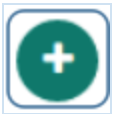
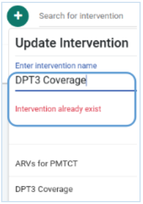
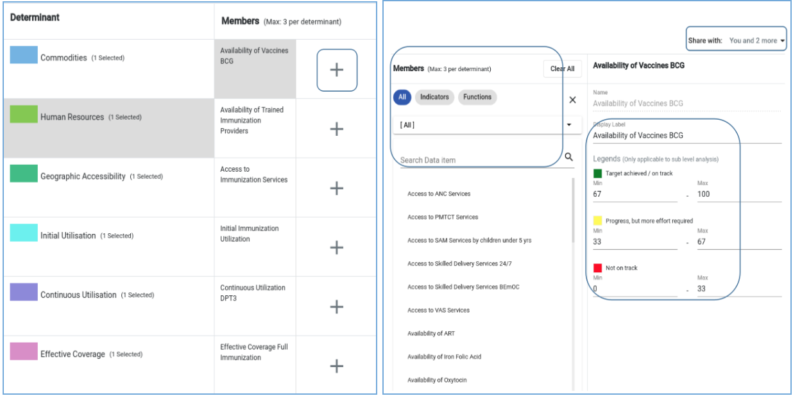
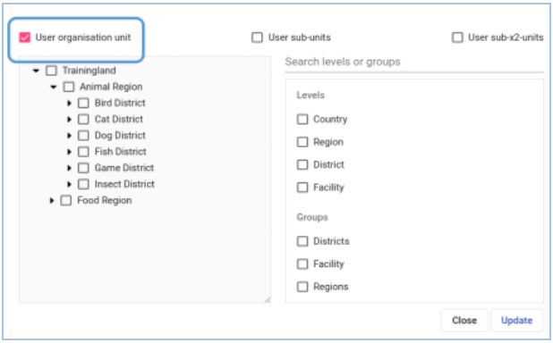
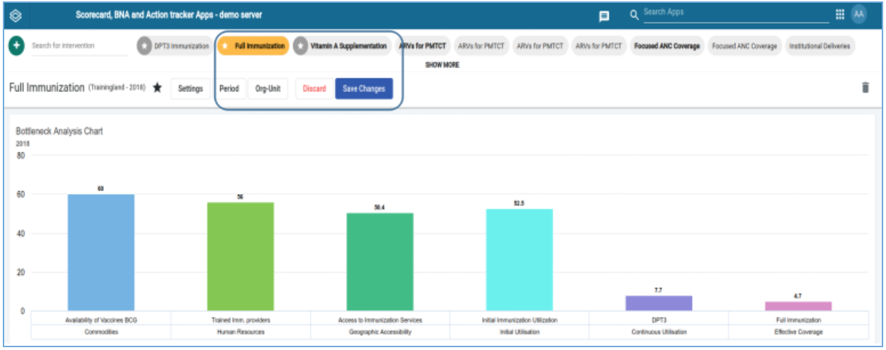
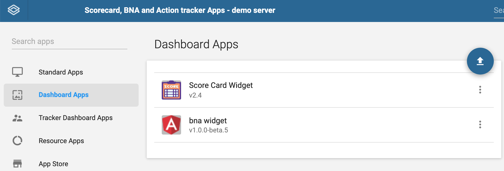

# BNA App Maintenance

## Interventions and Indicators Configuration

If no Intervention created and assigned to the dashboard, BNA App loads with
predefined interventions, with predefined indicators named “indicator 1” for
each determinant. Sub-level analysis and root cause analysis will be empty.

Administrative users can create Interventions and assign them to the dashboard
for other users to access depending on the sharing access granted to them.

### Creating Intervention

To create new intervention, administrative user can click on the blue plus sign
button just below list of interventions on the dashboard. Interventions are the
ones holding determinants which holds indicators.

{width=5%}

Then have to write the intervention name(eg. BEmOnC) and click create button to
save the intervention.

{width=50%}

**Note:** Attempting creating an intervention that is existing, will  be denied
by the system and presented a message that the intervention is already existing.

{width=25%}

### Interventions and Indicators configuration

Administrative users can configure interventions and indicators by clicking the
Settings button just below the intervention list on the dashboard to get the
setup page.

{width=50%}

Administrative needs to to share intervention for other users to access, set
the period for BNA presentation and analysis, decision to use indicator short
names as display names in the BNA chart, and legends for specified cut-off
points for indicator performance. Administrative users can change the colour
of each determinant group indicator(s).

{width=50%}

**Note:** Bar charts of every indicator attached to a particular determinant
group will inherit the colour of that determinant group.

To add indicators into a determinant group, just click on the plus sign button
to get a list of indicators from indicators or functions to add to the
determinant group for BNA chart configuration.

### Adding Indicators and Configuring legend-sets

Administrative users can add or remove indicators to and from determinants
groups by interacting through interface. To add an indicator to a determinant
group, users can click on the plus sign button to get a list of indicators or
functions to select and add.

Administrative users can configure cut-off points for poor, average, and good
performance for each indicator. Cut-off points are used in sub-level analysis
visualization.

{width=70%}

### Access control and Sharing interventions

Interventions must be shared for other users and user groups to access.
Interventions work in the same way as DHIS 2 dashboards. If not shared, only
users who created them can access and manage. There are three sharing options
that administrative users can share opt to share intervention.

1. **Can View and edit:** With this option, any user shared intervention with
this privilege can access and edit it, including changing settings of items in
it. This access should only be given to administrative users only.
2. **Can view only:** Administrative users should select this option to share
intervention with users who are supposed to access BNA chart and sub-level
analysis and enter root causes. For BNA application context, view only is
granted to district, regional and national users who are not supposed to make
any changes to the settings.
3. **No Access:** If you don’t want to share access to anyone.

{width=50%}

### Setting Organization Unit and Period

Administrative user can set organization unit and period and save changes for
BNA charts to load with. If you set a particular district, all users will get
the BNA charts loading for a selected district. Although users can filter the
chart with their preferred organization unit and period, it may may confuse
them. So it is important administrative user to set ‘user organization unit’
as default period so that every user can have BNA chart for their levels
displayed. It is good practice to assign user organization unit so that every
user can access BNA chart and sub-level analysis relevant to their levels.

{width=50%}

### Saving Configurations

After the administrator is satisfied with the filters that they have applied
for an intervention they have to save these configurations they have made for
the interventions. To save the configurations they simply have to click the
“Save Changes” button.

{width=70%}

 **Note:** Editing and saving configurations of a shared intervention will
 reflect the new configurations to the district end user with whom the
 intervention has been shared with.

## Standard data analytics

Data which is entered into DHIS2 must first be processed with the DHIS2
“analytics” engine. This means that data is not immediately available in the
analytics resources (such as the BNA chart, sub-org unit  level analysis tables,  
  pivot tables, data visualizer, GIS or  report) after it has been entered. If
  scheduling is active, the analytics process will run automatically at midnight
  each day. After that, new data which was entered since the last time the
  analytics process ran, will become visible.

You can trigger the analytics process manually by selecting
**Reports->Analytics** from the main menu and pressing the “Start export” button.
Note, the process may take a significant amount of time depending on the amount
of data in your database.

## Functions data analytics

Functions selections are extended analytics calculations supporting a more
open-ended logic of computation, such as logical operations, predictors and
other complex analytics use cases.
To create functions to work with BNA App,
download function maintenance application from this link: [https://play.dhis2.org/appstore/app/dXX2Fk6jwCX](https://play.dhis2.org/appstore/app/dXX2Fk6jwCX). Functions makes
use of pure good old JavaScript(vanilla JavaScript) logic to do calculations
purely on the browser, without the need for a server. This is accomplished by
execution of JavaScript codes that expects period and data selections and return
standard DHIS2 analytics results.
Functions selections are extended analytics
calculations supporting a more open-ended logic of computation, such as logical
operations, predictors and other complex analytics use cases.

## Maintenance of Indicator functions

Functions comprises of three key building blocks:

4. **Input/Selection parameters:** Function expects standard DHIS2 periods and
organization units selections.
5. **Computation logic:** This is an open-ended workspace for writing of
calculation logic to work on given period and organization unit selections,
computation logic is usually classified into rules dimensions, thus allowing
one function to support different use cases by defining multiple rules that
will control the computation logic. Possibilities are limitless, among major
operations done includes.
    1. Fetching data from aggregate and event analytics and modifying results
    with custom logic, and reformat the results back in standard analytics format.
    2. Fetching data from existing sql Views, performing custom logics and
    formatting results in standard analytics format.
    3. Fetching data from other DHIS2 API endpoints(such as data-value and
      events api) and other data sources(including external sources), performing
      custom logic and formatting results in standard analytics format.

6. **Output/Returned analytics**: This is the end-result output from functions,
formatted in 	standard analytics format, to allow compatibility with standard
DHIS2 analytics applications. To support open-ended support for any level of
complexity, function maintenance application has been developed, to allow any
developer with basic JavaScript knowledge to quickly develop custom calculations
either not supported natively by DHIS2 or to allow developers to work-around
limitations or miscalculations from standard analytics.

Main requirements for developing functions includes:
*   Basic web programming knowledge with JavaScript (jQuery is an advantage).
*   Understanding of DHIS2 Web API and analytics.
*   A working installation of Functions maintenance application. When a function
maintenance application is installed for the first time, it creates five standard
functions  with generic use cases as example functions to allow reuse of codes to
create other functions. The auto created functions will also be listed in the
functions selection list.

> **CAUTION**
>
> Sharing settings from 2.28 going back is only implemented on the
interface, access control is not strictly enforced, it is for simplicity in
management of BNA Interventions only through the datastore.

> **NOTE**
>
>User groups appearing on the access sharing list should exist in the user
groups that were created in the “Users” app.

### Bookmark an Intervention

To bookmark an intervention an administrative user will have to simply head on
to the control options found just below the list of interventions next to the
share icon there is a bookmark icon. Clicking the icon will bookmark the dashboard
that you are currently viewing. The name of the dashboard you are currently viewing
is also displayed on this control area.

{width=70%}

### Deleting an Intervention

The BNA App allows deletion  of an intervention from the system whenever necessary.
Deleting intervention means you delete all indicators, bottleneck charts, sub-level
analysis and root cause analysis created under that intervention. This is why before
deleting, you will be asked to confirm if you are sure you want to delete it,
where you will click “yes” to delete or “no” to cancel.
To delete an intervention, the administrative user can:
1. Go to search for intervention just allocated on the right hand side of
adding new intervention icon and
2. click the delete icon next to edit button on the the specific intervention.
3. Select an intervention from the list, and click “DELETE” button on the far
right side of the App and confirming deletion by clicking ‘yes’ option.

{width=25%}

{width=25%}

## BNA Widgets setup

### Accessing Widgets

BNA Widgets are meant to mainly be accessed by users at district levels.
Widget is a separate application that is installed in DHIS2 instance to work with
BNA Application. In case you don't find it in your DHIS2 instance, go to
App Management in the DHIS2 global menu to install it.

{width=70%}

{width=70%}

### Setting up Widgets

At first glance, when the administrator has installed the BNA Application into
a clean instance the root cause analysis data entry component of the intervention
will display a message prompting the user to head over to the DHIS2 Appstore and
download the “Root Cause Analysis Data Entry Widget”.
Detailed information on how to install an application from the DHIS2 app store
can be found in chapter 2.

If BNA application is taking too long to load, and you’re not on a slow
network, make sure you have cleared your browser cache.

BNA Application makes good use of cached files for better offline
experience, as a result, when installing higher version, BNA Application
may use older version of cached files and thus break down while loading.

## Clearing application cache

Approaches to clear application cache and browser interface, vary from
browser to browser; for example for Mozilla Firefox the keyboard
shortcut is “CTRL+SHIFT+DELETE” while for Google chrome the keyboard
shortcut is “CTRL+SHIFT+J”.

Accessing interface for clearing browser cache can be done via the
following approaches:               • Google chrome​: Go to the menu
icon on the top right corner, and click it to open, go to more tools
menu, and choose “Clear browsing data”. Once interface is open, Make
sure, “Clear the following items from” is set to “The beginning of
time”.                                 

• Mozilla Firefox​: Go to the menu icon on the top right corner, and
click it to open, go to -\>Library, and go to History, and choose “Clear
recent history”. Once interface is open, Make sure “Time range to clear”
is set to “Everything”, and “Details” option is expanded to show all
details options. Once on the clear browsing data or recent history, tick
“Cache”, “Cookies”, “Hosted app data” or “Offline Website data”. To
clear all cached files, cookies and locally stored data by bottleneck
.        

 {width=10%}

> **NOTE**
>
> These will also clear all cache information
and cookies from other websites you visited in your browser.

{width=70%}

{width=70%}

## BNA App Error Messages

The BNA Application has error messages for the expected errors that
could occur. For example attempting to access metadata that no longer
exists in the system.
