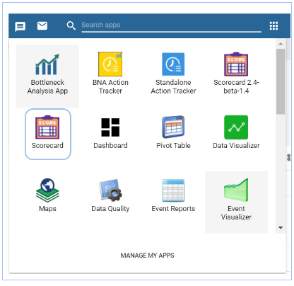
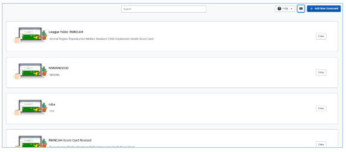
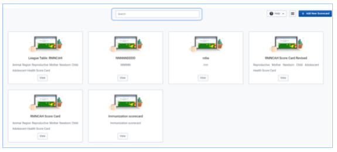

# Scorecard App architecture

The Scorecard Application is built on an architecture that eases the user interactions by having a design concept that promotes the user to follow their intuition complemented with high performance that considers the lowest internet connection scenarios with descriptive notification messages if the user misses a step along the way.

## Global DHIS2 Menu

When using the Scorecard App the Global DHIS2 Menu is accessible in its usual position. The user can use the global menu to access other apps and to log out of the system. Most of the app notifications will pop on the top position where the DHIS2 global menu exists.

## Selecting scorecard to track

Upon selecting the Scorecard app from the global DHIS2 menu, you will have the option to select the scorecard to track and visualize.

### Changing scorecards listing layout

You click on the option for managing display layout to change the display of scorecards from a horizontal to vertical listing and vice versa

### Searching for the scorecard

You may select the scorecard you want to access if it is seen on the list of search the scorecard name by typing the name in the search bar option.

Instead of using the search option, you may also use the navigation bar at the bottom of the list to move from one page of the scorecards list to another.
