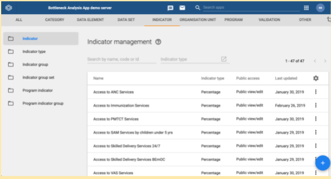

# Viewing the Scorecard App Analysis outputs

## Intended audience

Chapter 3 and others after it are intended for users of the scorecard app who do not have the access rights to edit a particular dashboard that they are viewing. These are users with the privilege to access scorecards configured, access and download outputs, and share with others. To create a new scorecard please refer to chapters 1 and 2 that focus on users who want to create a dashboard or have the privilege to edit the dashboard they are accessing.

## Rationale for the scorecard App

The use of health management information platforms like DHIS2 has helped health managers to collect, monitor, and use data for planning and decision making. Not all health managers have the analytical skills to perform data analysis and generate trends over time. Using tools like scorecards equip such managers with a tool that generates analysis automatically and displays them in a manner that would allow them to make decisions.

In relation to similar DHIS2 based apps like Bottleneck Analysis (BNA) and action tracker apps; the scorecard provides a way for health managers to track the performance of an unlimited number of indicators grouped as configured by the user. While BNA allows indicators configuration based on human resources, commodities, geographic coverage, initial utilization, continuous utilization, and effective utilization; the scorecard app provides users with the ability to track and group indicators based on their own preferences.

## Advantages of the scorecard App

The scorecard app provides you with a quick visual output of performances for different indicators making it easy to observe performances and trends. Using the default traditional colour codes red (for bad performance), yellow (for normal), and green (for good), users are easily pointed to indicators and locations with issues that need special attention.

**Note**: Although red, yellow, and green are used as default colours, users can use different colour codes for indicator outputs.

## Scorecard App meta-data

The Scorecard app borrows its meta-data from the general DHIS2 data source and uses this to create a data store for ease of analysis and visualization. The Scorecard app metadata such as indicators and indicator groups are managed using the DHIS2 Indicator maintenance App.

