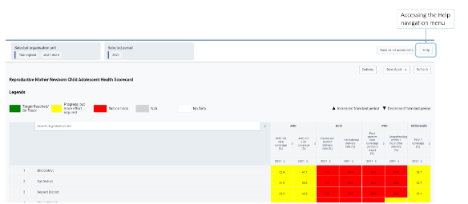
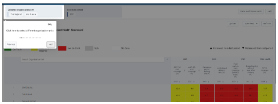
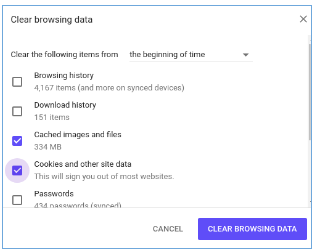
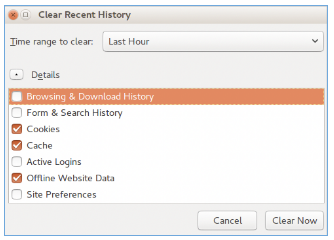
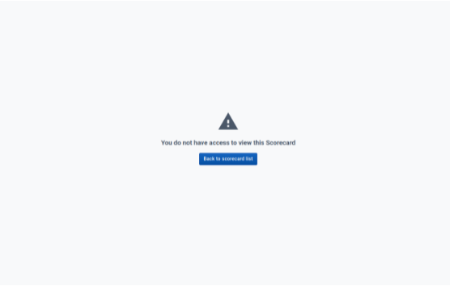

# Scorecard App Built-in Support and Maintenance Options

## Help navigation

In addition to this User-Guide, the scorecard app has a built-in Help navigation option that will provide you with descriptions. To access the Help guide click on the Help button then follow the steps highlighting different scorecard options and their functionalities.

Use the Previous or Next buttons to navigate from one option of the Help navigation to another. To end the Help navigation, you may click the Skip option

## Clearing application cache

If the scorecard action tracker application is taking too long to load, and you’re not on a slow network, make sure you have cleared your browser cache.

The Scorecard app makes good use of cached files for a better offline experience, as a result, when installing a higher version, the Scorecard app may use older versions of cached files and thus break down while loading.

Approaches to clear application cache and browser interface, vary from browser to browser; for example for Mozilla Firefox the keyboard shortcut is “CTRL+SHIFT+DELETE” while for Google chrome the keyboard shortcut is “CTRL+SHIFT+J”.

Accessing the interface for clearing browser cache can be done via the following approaches:

• Google Chrome​: Go to the menu icon on the top right corner, and click it to open, go to more tools menu, and choose “Clear browsing data”. Once the interface is open, Make sure, “Clear the following items from” is set to “The beginning of time”.

• Mozilla Firefox​: Go to the menu icon on the top right corner, and click it to open, go to ->Library, and go to History, and choose “Clear recent history”. Once the interface is open, Make sure “Time range to clear” is set to “Everything”, and the “Details” option is expanded to show all details options. Once on the clear browsing data or recent history, tick “Cache”, “Cookies”, “Hosted app data” or “Offline Website Data”. To clear all cached files, cookies, and locally stored data.

**_Note_**:_These will also clear all cache information and cookies from other websites you visited in your browser._

## Scorecard App Error Messages

The Scorecard app has error messages for the expected errors that could occur.

**Scorecard not found error:** This error (shown in Figure below) appears when the provided scorecard id (on the address bar) does not match any of the scorecard configurations present in the system. This error will most likely occur when a user accesses a scorecard by pasting a link on the address bar. To solve this error, ensure that the provided link is for a valid scorecard configuration.

**Access denied error:** This error (shown in Figure below) appears when a user tries to access a scorecard which he does not have access to. This will most likely occur when a user accesses a scorecard by pasting a link on the address bar. To solve this issue, ensure that the current user has proper access to the scorecard.

**General errors:** Other errors can occur during the app usage due to various reasons (network issues, for example). The errors will appear as shown in Figure below. A simple message of the error will be shown. If the error is technical, a descriptive message can be viewed when the user clicks on View logs button.Most of these errors can be solved by refreshing the application (through the Refresh button or the browser’s refresh button or CTRL + R)

