# Navigating the Standalone Action Tracker App

Standalone Action Tracker App can be found in the Apps menu. if the application has not yet been installed in your DHIS2 instance or installation has issues, refer to the installation instructions (Chapter 2) of this documentation for further guidance, or contact the DHIS2 administrator for your instance.

## Using global filters

### Organization units selection

The Standalone Action Tracker App allows the user to make organization unit selections based on implementation levels.

**Note:**
* The options for organization units’ selection will be limited based on the user's account. Standalone action tracker app inherits DHIS2’s configurations including user’s predefined locations when his/her account was created/

**Note:** Selection of the organization units should be aligned with the allowable planning level

### Period selection

The Standalone Action Tracker App allows users to make period selections for fixed periods, relative periods and extended relative periods.

All period selection types begin with clicking the period button on the global filters menu. Then clicking on the period type select option button which lists all the period types.

**Note:** Users should only select a period as per allowable planning cycle for the selected organization unit level. For example, if planning is done annually, then users should select years. The Standalone Action Tracker app has included a reminder of allowable period selection

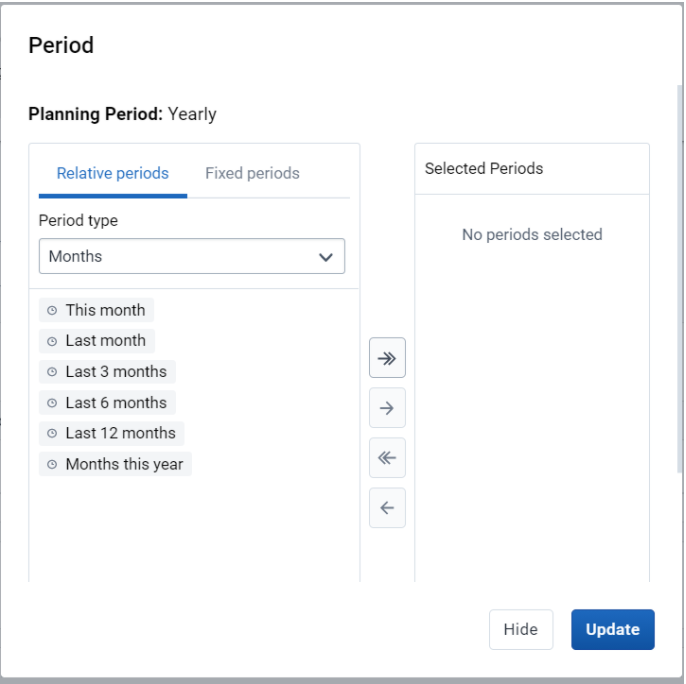

####  Fixed period selections 

To select fixed periods, start by selecting a period type from the period type list. You can then select periods from the list of available periods.

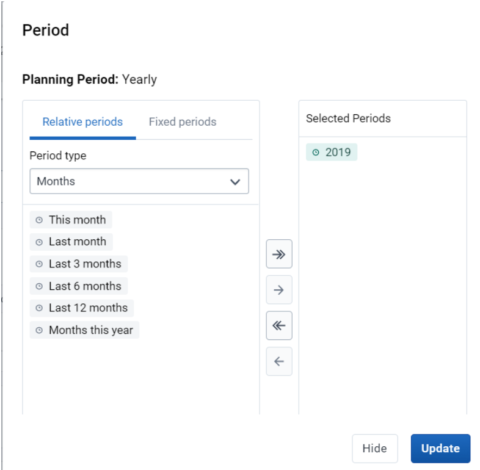

####  Relative period selections 

To select relative periods start by selecting a period type from the period type list. You can then select periods from the list of available periods.

## Actions planning

The first part of using the standalone action tracker allows users to document actions related to plans that they have done. Users will be able to use this section to define interventions, manage indicators and assignment of responsible entities for each action documented.

###  Managing intervention

Defining an intervention is the first step for tracking actions. Before users can define what action needs to be taken, they have to define the intervention they want to focus on. Definition of interventions allows creation of linkage of actions to be tracked with indicators. Linking interventions with indicators will allow users to be able to easily track impact of their actions (as indicators performance improves or worsen).

#### Adding intervention

To define an intervention whose corresponding actions should be tracked, the user should click on Add intervention tab. User can provide a description of the intervention to be tracked and select corresponding indicators.

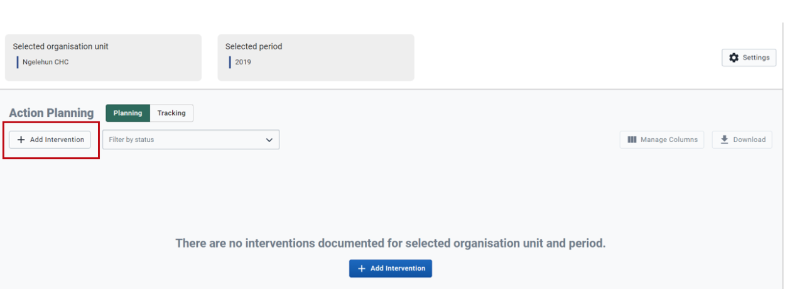

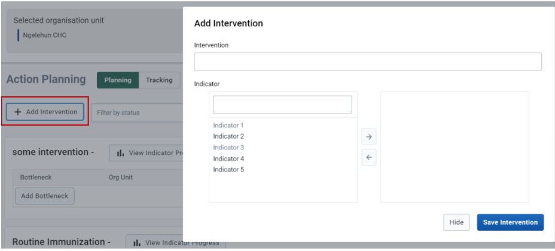

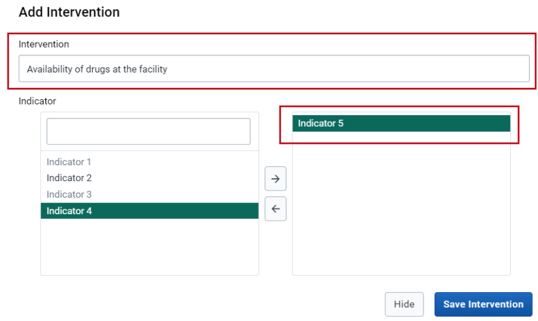

#### Managing intervention

To update existing intervention, click on the menu item highlighted below to access options for editing and/or deleting intervention.

To edit an intervention click on Edit option then update the intervention details on the pop-up window then click Save Intervention

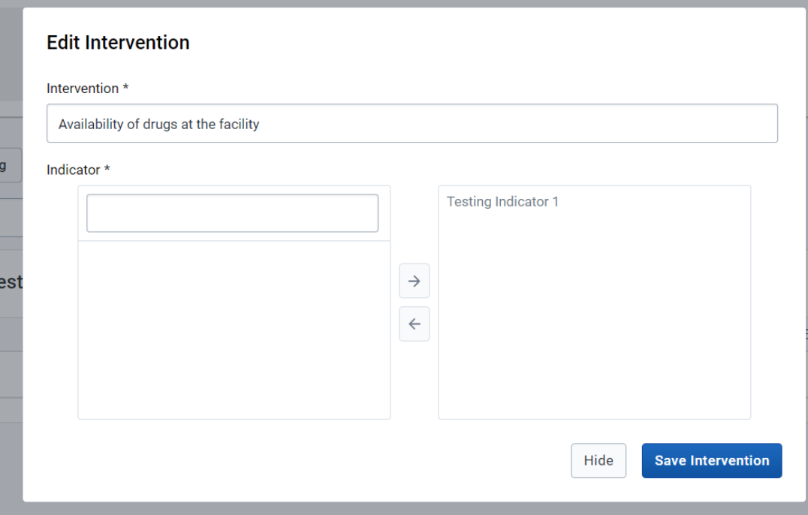

To delete intervention click on Delete option the click deletion confirmation button

### Managing bottlenecks

This is the second step for action planning. For each intervention that the user has defined, he/she has to outline the bottlenecks identified.

#### Adding bottleneck

To define a bottleneck whose corresponding actions should be tracker, user should click on Add bottleneck tab. 

Users can provide the bottleneck title, description and select the method that was used to identify the bottleneck to be registered. Upon completion of bottleneck definition, user should click Save Bottleneck

**Note:** Methods to be selected here should be first be added by the administrative user

#### Managing bottleneck

To update existing bottleneck, click on the menu item highlighted below to access options for editing and/or deleting details.

To edit a bottleneck click on Edit option then update the details on the pop-up window then click Save Bottleneck

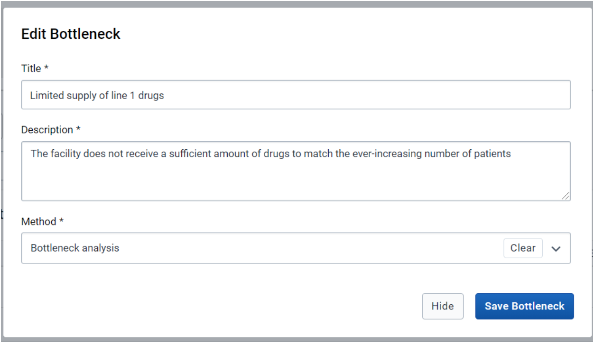

To delete bottleneck click on Delete option the click deletion confirmation button

### Managing solutions

For each intervention and bottleneck identified, user will define possible solutions to address the bottlenecks.

#### Adding solution

To define a possible solution whose corresponding actions should be tracked, user should click on Add solution tab. 

User can provide the solution description. Upon completion of bottleneck definition, user should click Save Solution

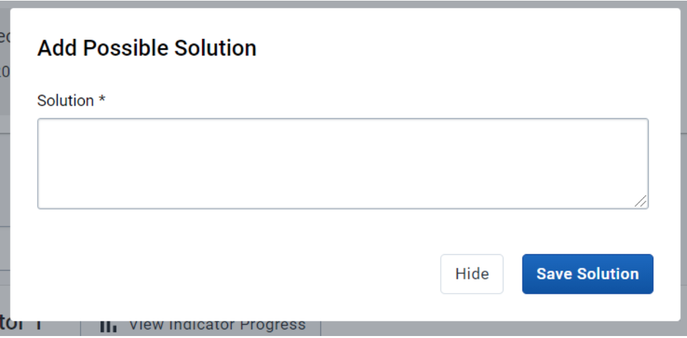

#### Managing solutions

To update existing solutions, click on the menu item highlighted below to access options for editing and/or deleting details.

To edit a solution click on Edit option then update the details on the pop-up window then click Save Solution

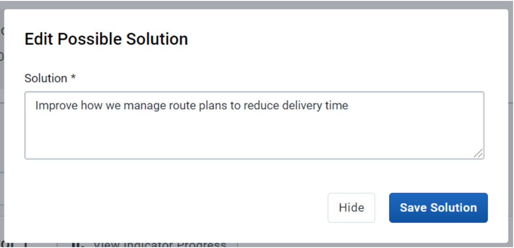

To delete a solution click on Delete option the click deletion confirmation button

### Managing actions

For each possible solution listed, users will be able to define what actions need to be taken. To allow for better tracking, each action for the possible solution will include assignment of responsible person and expected timeline for its execution.

#### Adding actions

To define an action to be taken whose corresponding actions should be tracker, user should click on Add action tab. 

User can provide the action title, description, execution start and end date, and responsible person. Upon completion of action definition, user should click Save Action

####  Managing actions

To update existing action, click on the menu item highlighted below to access options for editing and/or deleting details.

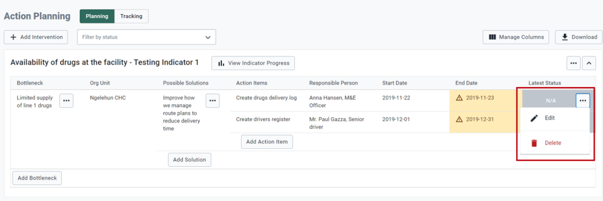

To edit an action click on Edit option then update the details on the pop-up window then click Save Action

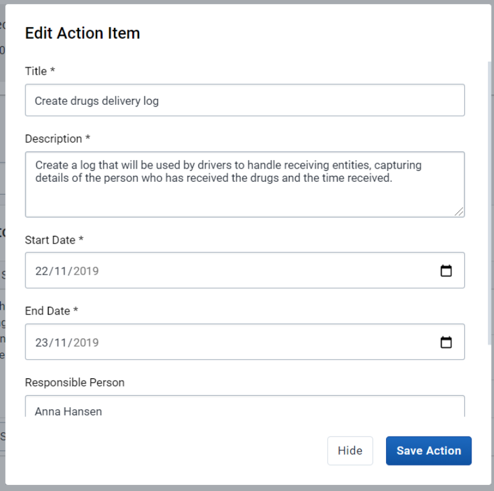

To delete an action click on Delete option the click deletion confirmation button

### Layouts and display management

#### Tracking indicators performance

For each intervention added, users can track performance of related indicator by click the View Indicator Progress button

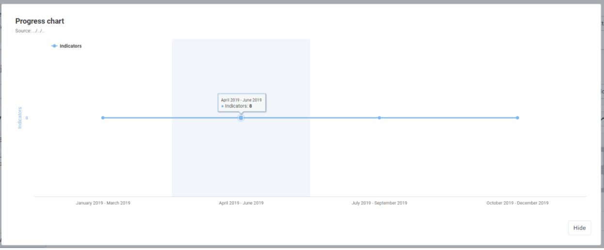

####  Filtering actions by status

For each intervention, user have the option to filter actions to be displayed based on their execution status e.g., completed actions, cancelled actions, etc. To filter actions to be displayed, user should click on Filter by Status option and select the desirable status to be viewed.

#### Managing columns displayed

For each intervention listed, users have the flexibility to select what columns should be displayed on the landing page for indicators. To access options for selecting columns to be displayed, the user should click on the Manage Columns tab.

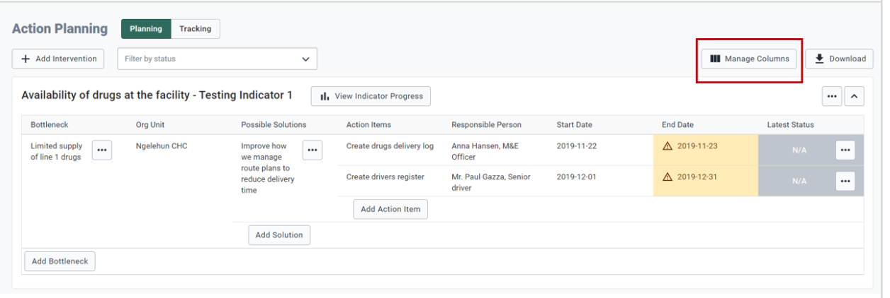

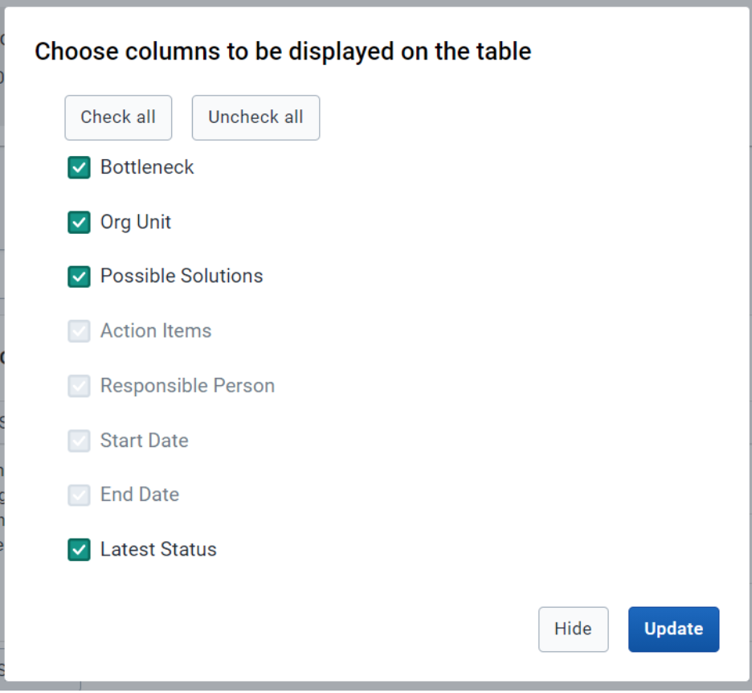

#### Downloading interventions

Users can download the details of the intervention added in PDF or Excel format by clicking on the Download tab and choosing the preferred file format to download.

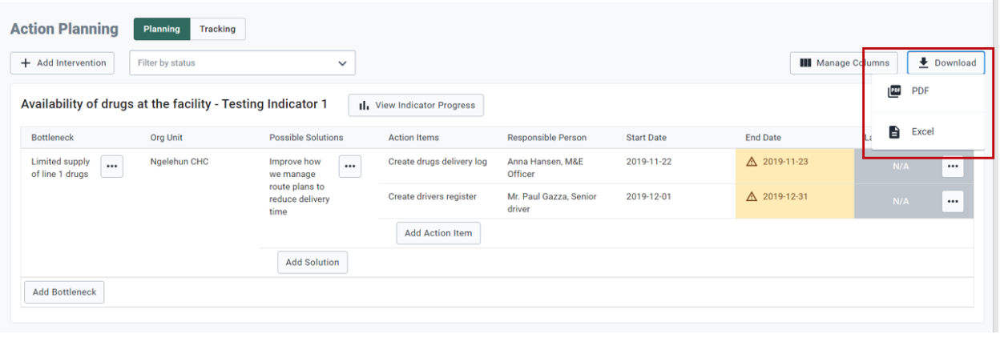

## Actions tracking

The actions tracking section allows users to manage tracking of status of actions defined for each possible solution. Tracking of action status is allowable in quarters. For each quarter, users will be able to add status update for each action defined

### Managing action status

To update action status for the given quarter, click on the plus sign in the quarter that user wants to track and update status.

#### Adding action status

To add status updates, users will be required to select the latest status of the action, add review date and any remarks which may be relevant to be referenced in future reviews. Upon completion of filling details, user should click on Save Action Status

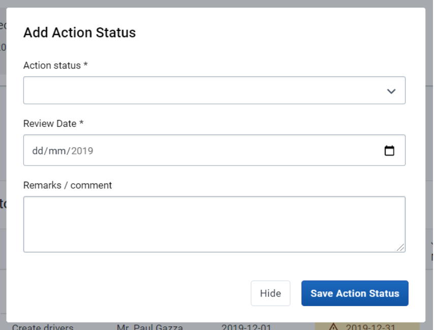

####  Updating action status

To edit or delete the action status update, the user should click on the option highlighted below.

To edit an action status update, the user should click on the Edit option and update the details on the pop-up window. Upon completion of the updating the details, user should click Save Action Status

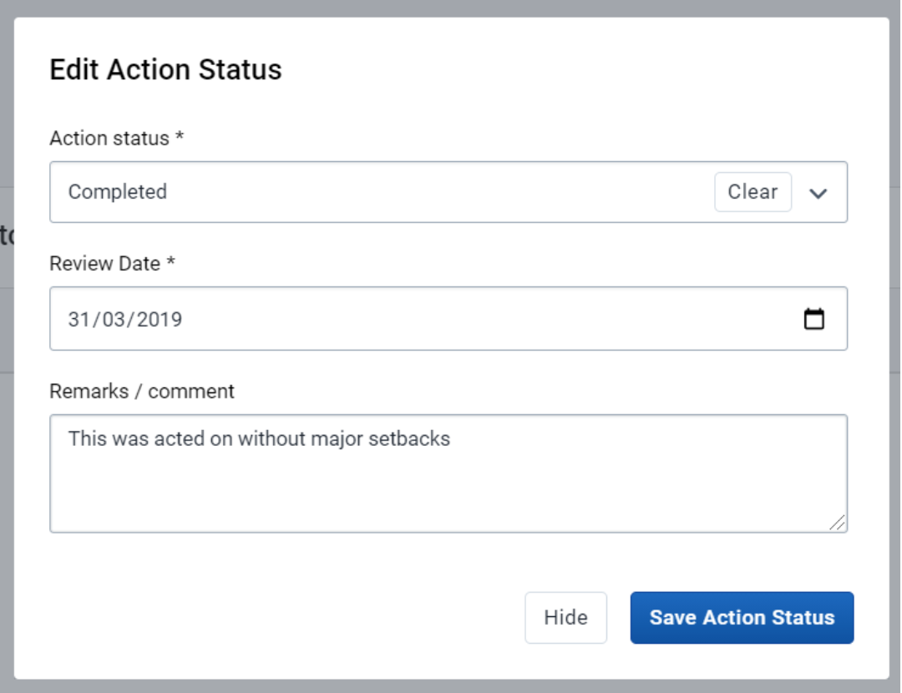

To delete action status progress information, the user should click on the Delete option and confirm deletion on the pop-up window.

###  Managing displays

Similar to action planning, for action tracking user can also view indicators progress (refer to 3.2.4.1 ), view action by status (refer to 3.2.4.2 ), manage columns to be displayed (refer to 3.2.4.3 ) and download interventions details (refer to 3.2.4.4 )