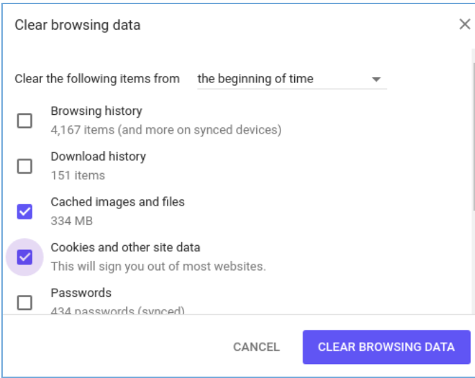
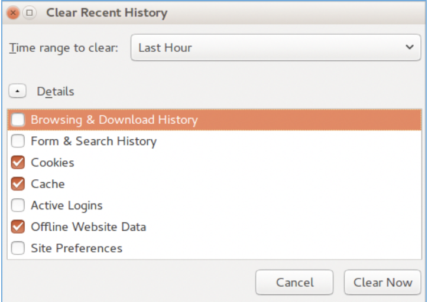

# Standalone action tracker App Maintenance

If Standalone action tracker application is taking too long to load, and you’re not on a slow network, make sure you have cleared your browser cache. 

Standalone action tracker Application makes good use of cached files for better offline experience, as a result, when installing higher version, Standalone action tracker Application may use older version of cached files and thus break down while loading. 

## Clearing application cache

Approaches to clear application cache and browser interface, vary from browser to browser; for example for Mozilla Firefox the keyboard shortcut is “CTRL+SHIFT+DELETE” while for Google chrome the keyboard shortcut is “CTRL+SHIFT+J”.

Accessing interface for clearing browser cache can be done via the following approaches: • **Google chrome**​: Go to the menu icon on the top right corner, and click it to open, go to more tools menu, and choose “Clear browsing data”. Once interface is open, Make sure, “Clear the following items from” is set to “The beginning of time”. 				

• **Mozilla Firefox**​: Go to the menu icon on the top right corner, and click it to open, go to ->Library, and go to History, and choose “Clear recent history”. Once interface is open, Make sure “Time range to clear” is set to “Everything”, and “Details” option is expanded to show all details options. Once on the clear browsing data or recent history, tick “Cache”, “Cookies”, “Hosted app data” or “Offline Website data”. To clear all cached files, cookies and locally stored data by bottleneck .	

**Note:** These will also clear all cache information and cookies from other websites you visited in your browser. 

## Standalone action tracker App Error Messages

The standalone action tracker Application has error messages for the expected errors that could occur. For example attempting to access metadata that no longer exists in the system.